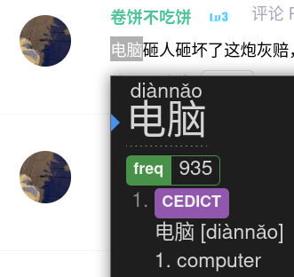
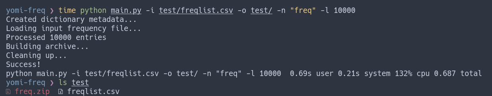

# Yomichan Frequency List Generator

Often times, it can be helpful to look at the frequency of a word as you're looking it up.


The goal of `yomi-freq` is to make this efficient workflow more widely accessible by allowing the user to generate their own Yomichan frequency list dictionaries.

## Installation

After ensuring that you have Python and Pip installed, clone the repository and install the necessary dependencies:

```
git clone https://github.com/kamui-fin/yomi-audio && cd yomi-audio
pip install -r requirements.txt
```

## Usage

The basic usage of `yomi-freq` is by supplying an input list file and output directory:

```
python main.py -i [path] -o [path]
```

The default output directory is the current directory.

Additional options include:

-   `--name`: custom name for dictionary (default: input file name)
-   `--revision`: custom revision name for metadata (default: freq)
-   `--limit`: limit number of entries in dictionary (default: no limit)
-   `--chunksize`: custom size for each chunk during processing: (default 10,000)

### Format

The frequency list must be structured in the following way:

```
[word][delimiter][frequency]
```

The `delimiter` character is up to you but optimally it's either a comma or tab. `frequency` can either mean the number of times it appeared in the corpus or the "rank", in the sense that the lower the number, the higher the frequency. Either way is accepted, the only important part is the structure.

### Example



`freq.zip` is the output Yomichan dictionary file and can be directly imported now.

## Contributing

All contributions in the form of pull requests, bug reports, etc. are gladly welcomed. If you would like another frequency list format to be supported, let me know.

[](https://www.gnu.org/licenses/gpl-3.0)
