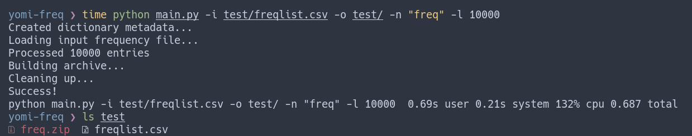

# Yomichan Frequency List Generator

Often times, it can be helpful to look at the frequency of a word as you're looking it up.


The goal of `yomi-freq` is to make this efficient workflow more widely accessible by allowing the user to generate their own Yomichan frequency list dictionaries.

## Installation

After ensuring that you have Python and Pip installed, clone the repository and install the necessary dependencies:

```
git clone https://github.com/kamui-fin/yomi-audio && cd yomi-audio
pip install -r requirements.txt
```

## Usage

The basic usage of `yomi-freq` is by supplying an input list file and output directory:

```
python main.py -i [paths...] -name [name]
```

Additional options include:

- `--output`: directory where the output dictionary is stored (default: `.`)
- `--revision`: custom revision name for metadata (default: freq)
- `--limit`: limit number of entries in dictionary (default: no limit)
- `--chunksize`: custom size for each chunk during processing: (default 10,000)

Multiple lists can be combined into a single yomichan frequency list by passing in multiple paths to `-i`. Frequency values are calculated using `mean` and rounded.

### Format

The script expects some sort of list or csv-like file where each line starts with a single word, followed by a delimiter. For example, the following structure is accepted:

```
[word][delimiter][frequency]
```

So is:

```
[word]
```

The `delimiter` character is up to you but optimally it's either a comma or tab. Only the `word` column will be read in the existing order to determine the resulting frequency "ranking", in the sense that the smaller the value, the more frequenct the word is.

### Example



`freq.zip` is the output Yomichan dictionary file and can be directly imported now.

## Contributing

All contributions in the form of pull requests, bug reports, etc. are gladly welcomed. If you would like another frequency list format to be supported, let me know.

[](https://www.gnu.org/licenses/gpl-3.0)
